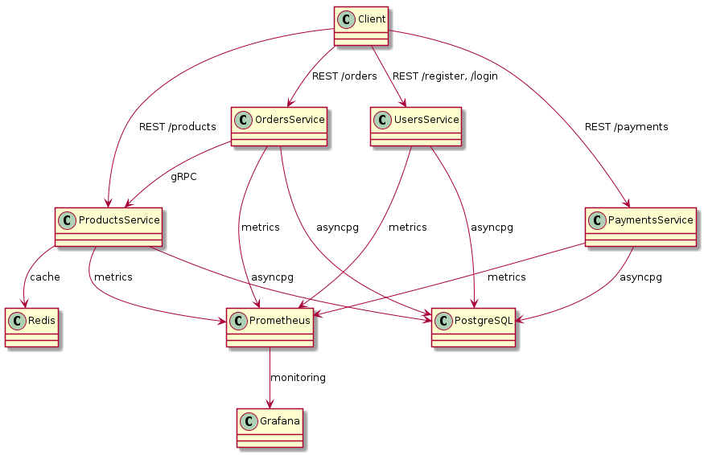

# Micro E-commerce Platform


## Описание

Микросервисная e-commerce платформа на FastAPI, PostgreSQL, Docker, gRPC, Redis, Prometheus, Grafana и GraphQL Gateway.

**Функционал:**
- Регистрация и аутентификация пользователей (JWT, роли user/admin)
- CRUD для пользователей и товаров
- Оформление и оплата заказов
- Эмуляция платежей
- Кэширование продуктов (Redis)
- gRPC между Orders и Products
- GraphQL API Gateway для клиентов
- Rate limiting (slowapi)
- Мониторинг (Prometheus, Grafana)
- Документация OpenAPI/Swagger для каждого сервиса

## Архитектура
- **Users Service** — пользователи, аутентификация, роли
- **Products Service** — товары, кэширование, gRPC сервер
- **Orders Service** — оформление заказов, gRPC клиент
- **Payments Service** — эмуляция оплаты, интеграция с Orders
- **Gateway Service** — GraphQL API для клиентов
- **PostgreSQL** — отдельная БД для каждого сервиса
- **Redis** — кэш продуктов
- **Prometheus & Grafana** — мониторинг

## Быстрый старт

```bash
git clone https://github.com/your-org/micro-ecommerce-platform.git
cd micro-ecommerce-platform
docker-compose up --build
```

- Swagger UI: http://localhost:8001/docs (Users), http://localhost:8002/docs (Products), ...
- GraphQL Playground: http://localhost:8080/graphql
- Grafana: http://localhost:3000 (логин/пароль: admin/admin)
- Prometheus: http://localhost:9090

## Примеры GraphQL-запросов

```graphql
query {
	products(limit: 5) {
		id
		name
		price
	}
	product(id: 1) {
		name
		description
		price
		stock
	}
}
```

## Тесты

```bash
# Для каждого сервиса:
docker-compose exec users_service pytest
```

## Мониторинг
- Метрики Prometheus доступны по /metrics у каждого сервиса
- Grafana дашборды для анализа нагрузки и ошибок

## CI/CD
- GitHub Actions: линтеры, тесты, сборка Docker-образов

## TODO / Бонус-фичи
- gRPC между всеми сервисами
- Кэширование заказов
- Полноценный API Gateway (GraphQL + REST)
- Rate limiting на уровне gateway
- Расширенная документация и тесты

---

# micro-ecommerce-platform